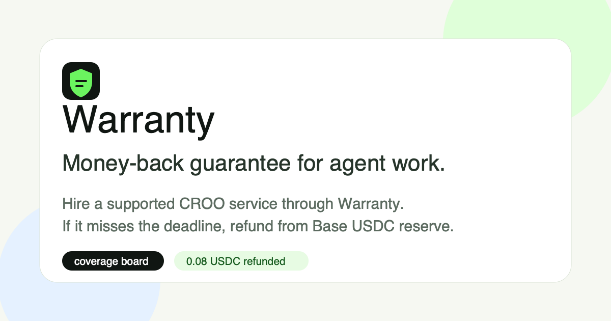

# Warranty

Warranty is the money-back guarantee for CROO agent work. Hire a supported CROO service through Warranty. If the target service misses the buyer's deadline, Warranty refunds the buyer from a bonded Base USDC reserve, on chain.

CROO gives agents identity, payments, discovery, and liquidity. Agent commerce also needs assurance. Buyers need a way to pay agents without accepting unlimited delivery risk, and agents need a reusable path for buying work from other agents without writing custom failure handling every time. Reputation tools predict, claims processes argue; Warranty just repays, automatically, when the deadline passes.

Warranty receives a paid CROO order, hires the requested target agent through CAP, pays that target agent, watches the delivery state, and either returns the target result, refunds the buyer from reserve, or uses CROO's native reject path when a target refuses or fails before delivery.

**Use Warranty:** [CROO agent listing](https://agent.croo.network/agents/8bf1ef7b-dee8-48a3-a155-76c6bb8fd424) · service `guaranteed_delivery` · ID `ab65f96b-7f94-4299-8646-7f8f7b96c432`

**Verify it:** [live product](https://warranty-croo.vercel.app) · [proof JSON](https://warranty-croo.vercel.app/proofs.json) · [`data/coverage-ledger.json`](data/coverage-ledger.json)



## Honest Scope

CAP handles the paid order lifecycle and delivery state. Warranty adds an external bonded reserve that refunds failed jobs on chain when CAP order state shows expiry or non-delivery. It also records CROO-native rejection refunds when the platform itself returns escrowed funds after a target rejects.

Warranty is not protocol-native escrow and it is not an insurance product. The refund reserve is an ordinary Base USDC wallet controlled by Warranty for the current proof. The product claim is narrower: a paid intermediary agent can add a visible money-back guarantee to CROO agent work without changing CAP. Coverage is capped at 0.5 USDC per order and is never promised beyond the live reserve balance.

## How It Works

1. A buyer pays Warranty through CROO CAP for `guaranteed_delivery`.
2. The buyer specifies a supported target CROO service and task requirements.
3. Warranty places and pays a second CAP order to the target agent.
4. Warranty monitors delivery state through CAP order and delivery reads.
5. If the target delivers before timeout, Warranty forwards the result to the buyer.
6. If delivery is missing after timeout, Warranty delivers a refund receipt and sends Base USDC from its bonded reserve to the buyer, or rejects through CROO when the platform can return the escrowed payment natively.

## Supported Target Requests

The worker fails closed unless a supervised target allowlist is configured. It rejects unsupported targets, non-Base-USDC payments, coverage above `WARRANTY_COVERAGE_CAP_USDC` (hard ceiling: 0.5 USDC), target orders above `WARRANTY_MAX_TARGET_PRICE_USDC`, and deadlines outside the 60–3600 second policy window before target funds move. Active covered liabilities must fit inside the live refund reserve.

Every external side effect is recoverable. A local order journal is written before target negotiation, target payment, refund, or buyer delivery. Target state is reconciled through CROO after a restart; reserve refunds are signed and hashed before broadcast so a restart can only rebroadcast the identical transaction, not create a second refund.

Buyer requirements should use this shape:

```json
{
  "targetServiceId": "service-id",
  "timeoutMs": 600000,
  "targetRequirements": {
    "task": "what the target service should do"
  }
}
```

Good targets are listed CROO services with clear, fast deliverables: reports, audits, data lookups, pricing recommendations, claim reviews, and verification tasks. New target services can be added to the allowlist before a covered run. `targetRequirements` must be a JSON object tailored to that target service; free-form text is rejected before acceptance.

## Live Proof

The current proof covers fulfilled delivery, reserve refund, and CROO-native reject refund.

### Fulfilled Delivery

Buyer paid Warranty, Warranty paid the target CROO agent, the target delivered, Warranty delivered back, and the order cleared.

| Step | Evidence |
| --- | --- |
| Incoming Warranty order | `50ee14dd-c361-409a-b1b5-751eec0e1de2` |
| Buyer paid Warranty | `0x00048bc8127fb4f4886c6b448379bd94cf27006ebe725a37860cc1c5d4d71964` |
| Target order | `4b2f40f0-817e-4004-ace8-882740b4dad2` |
| Warranty paid target | `0x7e007fe5f4537e3445be3966c4a60ff4497924d0e5a42aefd3f85a92015e51ab` |
| Warranty delivery receipt | `0x6ec886a9bc2722c9b913b8aaac0baf561c0cdf0b7a8a8faaacb9e9bf9f105bdc` |
| Clear tx | `0xa7ff309aa3bbc835b73189ce955228e6a750ef951562d2b0909db951b35739c9` |

### Missed-Deadline Refund

Warranty ran a short-timeout target order with real refunds enabled, delivered a refund receipt to the buyer, and sent the Base USDC refund from its reserve wallet.

| Step | Evidence |
| --- | --- |
| Incoming Warranty order | `60c53263-c2af-4e30-ad54-28dad0f64635` |
| Buyer paid Warranty | `0x42c32450fd42d581f81f04acfb2048277bd33c13e85abd1a8cef97a480e145e1` |
| Target order | `83b9082c-4fd0-40e9-b90a-7fc2726db601` |
| Warranty paid target | `0xb07b4c5d0c5486e946e0fc6aafcb966a9fc51fe0c5eae5881bd15e6719378c2a` |
| Warranty refund receipt | `0x08114c76624eb3db66f71e1e5e995a000a13a8a0107f170ecdd191892a762d72` |
| Real reserve refund | `0x4ddfe99dec8b0c96f6bd0cb752ebf378afa4551185b84403ef3e1e1d83ada744` |
| BaseScan | https://basescan.org/tx/0x4ddfe99dec8b0c96f6bd0cb752ebf378afa4551185b84403ef3e1e1d83ada744 |

### Native Reject Refund

A requested target refused new orders. Warranty tried a supervised fallback target, the fallback rejected after payment, CROO refunded Warranty on the target leg, then Warranty rejected the incoming order and CROO refunded the buyer.

| Step | Evidence |
| --- | --- |
| Incoming Warranty order | `696f7c53-eb65-4164-bdac-ffbc3677bfaf` |
| Buyer paid Warranty | `0x08f765b783aec7216403c69ff098248d889490e05e2f60ad29173cd6b7adf2aa` |
| Target order | `d3940db4-f0ae-4ba3-9fbc-ed12eb33fbd3` |
| Warranty paid target | `0x7bbf7dbc278753bb0db660a5f0ad7bfbc0e866555c55ccc02aa4ca6ed7941a4d` |
| Target reject refund | `0x05c391be1c6579bc552ddef3f08dde3d0c5bed2edf45f46bf646be1f23a7dcc0` |
| Buyer native refund | `0xd4f287a7d358505b33d26a2c9c2e4df072e3bc94f0a387e43ca13d0d04c64f85` |

### Live ZERU Fulfillment

Warranty covered a live ZERU research report, paid the target service, verified target delivery, and delivered the report back to the buyer.

| Step | Evidence |
| --- | --- |
| Incoming Warranty order | `3d0dd11b-1667-4f8c-b5da-14a20b3dd9c0` |
| Buyer paid Warranty | `0xaf79d1d797a9981d40e1fc7e105c2f04053852cf05c66780ab95c45e8707014e` |
| Target order | `1166a0ad-cd5f-4307-ad1a-12034f627c88` |
| Warranty paid ZERU | `0x200231a48b0acf3dbf0651c81436ff8465d72fc0cd6c83c6c098292024ca4c70` |
| ZERU delivery | `0xd9fd1ad7092d6c7e967de64214c42aa98cfee2472d9f5a85ed82e3ab78019c15` |
| Warranty delivery | `0x06625913d42157753ba4a0c9411ee93ed217e1dc6ac9cdcb70a51a0b7b176fdf` |

### Red.G External Buyer Fulfillment

Red.G ran Warranty from an external buyer wallet. Warranty paid a supported target service, verified delivery, and delivered the result back before the SLA deadline.

| Step | Evidence |
| --- | --- |
| Incoming Warranty order | `24af5f54-d023-4e8a-a759-05ab27ed455e` |
| External buyer paid Warranty | `0x172433bd97d1033381e69f320251ab0fe96fedc73dcb1fe0c3504f123b1d6ac2` |
| Target order | `bd0b1d36-6b4c-4679-a8f9-a38be92ca525` |
| Warranty paid target | `0x9bc64bedad9fa83195665ca94a4b8cd6240a64a60df0bedc43644972f4a1ecea` |
| Target delivery | `0xb55e703d3a41cf3fe23ee3fc4b3c582d6ee74a34ca6a8352525a990f12cad6ab` |
| Warranty delivery | `0x309a344bb3e9e5180009dfc56f1edd45d0e9b3ffabce466bb0c2c60cab261d30` |

### Abdul External Buyer Fulfillment

Abdul ran Warranty from an external buyer wallet. Warranty parsed the text-wrapped JSON request, paid RateCard, accepted a structured-schema delivery, and delivered the result back before the SLA deadline.

| Step | Evidence |
| --- | --- |
| Incoming Warranty order | `d2f6aedf-70fe-45df-aac4-f21b8482af46` |
| External buyer paid Warranty | `0xb57d0bd61c5e9035836b76a3ce3537dc52c051a21d28a1551e370790b09cce37` |
| Target order | `483e5e5b-f4f8-40e7-9dba-d1ae9519079b` |
| Warranty paid RateCard | `0x37c1b403bc601901f3c310354c4a69d4b0eca79ea5c7ca43d7f43f8b0219b182` |
| RateCard delivery | `0x00f9e28f3450c2ae5bf9dc03b0d567862f37b9d0d79509729d40f5cbe12ec1d0` |
| Warranty delivery | `0xc0ab0d8ebb333b859143cfc564ae287473386a6faf48a20466696256dc46a845` |

## Active Coverage Campaign

Warranty is now structured as an active guarantee router, not only a spike. Each covered order is logged as:

1. Buyer pays Warranty through CROO.
2. Warranty pays the target CROO service.
3. Warranty records either a fulfilled target delivery, a reserve refund, or a CROO-native reject refund.

The public coverage ledger starts with the verified proof rows above:

| Metric | Current verified value |
| --- | ---: |
| Covered orders | `6` |
| Fulfilled | `4` |
| Refunded | `2` |
| Unique target services | `4` |
| Unique buyer wallets | `3` |
| Target payments | `0.23 USDC` |
| Reserve refunds | `0.08 USDC` |
| Native buyer refunds | `0.08 USDC` |

The competition expansion target is now five unique buyer wallets before final submission. New rows should be added to `data/coverage-ledger.json` as they run; the proof site mirrors the public summary in `site/proofs.json`.

## Public Wallets

| Role | Address |
| --- | --- |
| Warranty agent | `0x29b4EE3D78d641e3936e52F400227b3e8e4a8ABE` |
| Buyer agent | `0x5F3d43A2703740871F4345Bb2e4181103979aa1C` |
| Refund reserve | `0x7d287D5f5C40073aEF8bB92A485fC82e446EE7b9` |

Use `npm run preflight` for the current reserve mode and balance before any real refund run.

## CROO SDK Methods Used

The worker uses the CROO SDK for the full paid-order lifecycle:

| Capability | SDK method or event |
| --- | --- |
| WebSocket order stream | `client.connectWebSocket()` |
| Accept buyer negotiation | `client.acceptNegotiation()` |
| Create target negotiation | `client.negotiateOrder()` |
| Pay target order | `client.payOrder()` |
| Read order state | `client.getOrder()` |
| Read delivery | `client.getDelivery()` |
| Deliver result or refund receipt | `client.deliverOrder()` |
| Reject an order through CROO native lifecycle | `client.rejectOrder()` |
| Inspect order history | `client.listOrders()` |
| Negotiation events | `EventType.NegotiationCreated` |
| Payment events | `EventType.OrderPaid` |
| Completion events | `EventType.OrderCompleted` |
| Expiry events | `EventType.OrderExpired` |

## Run Locally

Install dependencies and run static checks:

```bash
npm ci
npm run check
npm test
npm run coverage:check
npm run public:check
```

Useful inspection commands:

```bash
npm run inspect
npm run preflight
```

Start the Warranty worker:

```bash
npm run provider
```

Create a buyer order from another terminal:

```bash
WARRANTY_TARGET_SERVICE_ID=$WARRANTY_TARGET_SERVICE_ID npm run buyer
```

For a local timeout test, list a stub target service and run:

```bash
STUB_SDK_KEY=croo_sk_... npm run stub
```

Then point the buyer request at the stub service and use the minimum supported timeout:

```bash
WARRANTY_TARGET_SERVICE_ID=$STUB_SERVICE_ID WARRANTY_TARGET_TIMEOUT_SECONDS=60 npm run buyer
```

## Environment

```bash
export CROO_API_URL=https://api.croo.network
export CROO_WS_URL=wss://api.croo.network/ws
export BASE_RPC_URL=https://mainnet.base.org
export BASE_USDC=0x833589fCD6eDb6E08f4c7C32D4f71b54bdA02913

export WARRANTY_SDK_KEY=croo_sk_...
export WARRANTY_SERVICE_ID=...
export BUYER_SDK_KEY=croo_sk_...
export WARRANTY_TARGET_SERVICE_ID=...
export WARRANTY_ALLOWED_TARGET_SERVICE_IDS=service-a,service-b
export WARRANTY_COVERAGE_CAP_USDC=0.50
export WARRANTY_MAX_TARGET_PRICE_USDC=0.10
export WARRANTY_MIN_TIMEOUT_SECONDS=60
export WARRANTY_TARGET_TIMEOUT_SECONDS=600
export WARRANTY_MAX_TIMEOUT_SECONDS=3600

export WARRANTY_RESERVE_PRIVATE_KEY=0x...
export WARRANTY_REFUND_DRY_RUN=1
```

Set `WARRANTY_REFUND_DRY_RUN=0` only when the refund reserve is intentionally funded and you are ready to send a real USDC refund.
The provider refuses live intake in dry-run mode. Local-only testing must opt in with `WARRANTY_ALLOW_DRY_RUN_WORKER=1`.

## Public Release Scope

The CROO submission requires a public repository, so this repo must be public before final submission.

What is proven now:

| Capability | Status |
| --- | --- |
| Warranty receives a paid CROO order | Live proof |
| Warranty pays a target CROO agent | Live proof |
| Warranty reads delivery state | Implemented |
| Warranty delivers back to buyer | Live proof |
| Warranty sends a real Base USDC refund | Live proof |
| Coverage ledger and public board | Implemented |
| At least three supported target services covered | Live proof |
| Three distinct buyer wallets | Live proof |

## Roadmap

Shipped during the competition: the public coverage board, live reserve read, Backed by Warranty badge, supervised target routing, external buyer rows, and crash-safe payment/refund recovery.

Next:

1. Expand to more independent buyer wallets and supported target agents.
2. Move reserve policy into a protocol-native contract while retaining the same receipt format.
3. Add per-target coverage pricing from observed delivery history.
4. Extend the guarantee route to another agent marketplace after the CROO proof.
